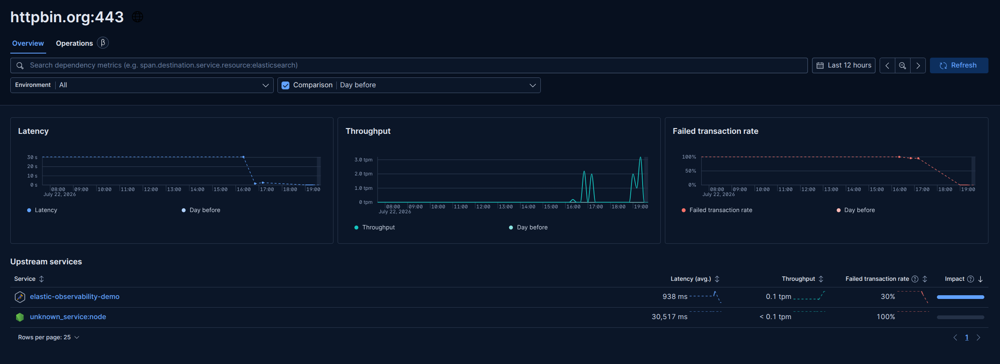

# Elastic Observability Demo

A Node.js webhook service instrumented with OpenTelemetry, sending traces, metrics, and logs to Elastic Observability (APM).

## What it does

- Receives webhook events via a POST endpoint
- Validates incoming payloads and event types
- Detects and skips duplicate events using idempotency keys
- Processes events asynchronously so the sender never waits on downstream services
- Calls an external API and handles success and failure responses
- Emits distributed traces, metrics, and structured logs to Elastic via OTLP

## Screenshots

### Kibana Dashboard


### Service Map


### Service Overview


### Transactions


### Dependencies


## Architecture

```
Event Source / Browser UI → Webhook Service (Node.js) → Elastic Observability
                                      |
                                      └→ External API (httpbin.org)
```

OTel auto-instrumentation captures every inbound HTTP request and outbound API call automatically, with no manual span creation required.

## Observability setup

Instrumentation is handled in `tracing.js` using the OpenTelemetry Node.js SDK. The SDK is loaded before the app starts via `require('./tracing')` at the top of `server.js`. Structured logging is handled by `pino`, emitting JSON logs that Elastic indexes and correlates with traces.

Three environment variables configure the connection to Elastic Cloud:

- `OTEL_EXPORTER_OTLP_ENDPOINT` — your Elastic ingest endpoint
- `OTEL_EXPORTER_OTLP_HEADERS` — API key authorization header
- `OTEL_RESOURCE_ATTRIBUTES` — service name, version, environment

## Event types

The service accepts the following event types:

- `order_created`
- `order_updated`
- `order_cancelled`
- `payment_processed`
- `payment_failed`

## How to run it

Copy `.env.example` to `.env` and add your Elastic Cloud credentials.

Install dependencies:

```bash
npm install
```

Start the server:

```bash
node server.js
```

Open the frontend UI:

```
http://localhost:3000
```

Or send a test event via curl:

```bash
curl -X POST http://localhost:3000/webhook \
  -H "Content-Type: application/json" \
  -d '{"event": "order_created", "traveler_id": "C-001", "event_id": "EVT-001"}'
```

## Tech stack

- Node.js
- Express
- Pino (structured logging)
- OpenTelemetry SDK (auto-instrumentation)
- Elastic Cloud Serverless (Observability)
